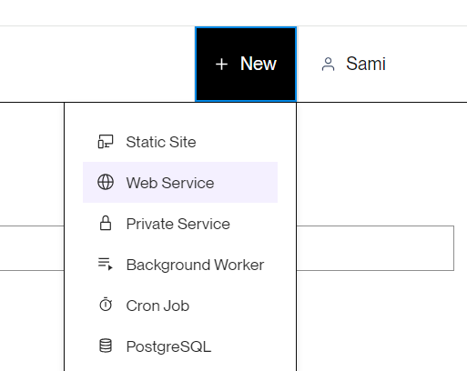
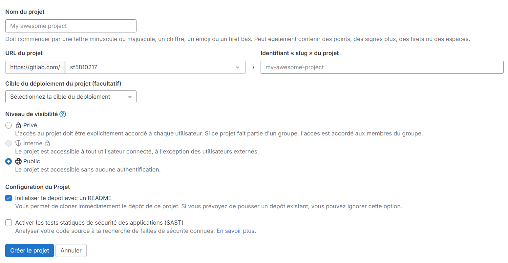

.. _CI/CD:

===================================
Set up a ci cd pipeline with Gitlab
===================================

Gitlab
======

**Now, create a new repository on your Gitlab account:**

.. image:: img/gitlab-repo.png

**Complete the informations and put the visibility in "public":**

**Next we will push the project from your local machine to your new repository:**

.. code::

    git remote add origin "your https url repository"
    git push origin main

.. figure:: img/variables.png
    **Go to the tab Parameters, CI/CD, variables and click on display**

.. figure:: img/all-variables.png
    **Complete these variables with your data**

.. figure:: img/django-debug.png
    **For DJANGO_DEBUG variable put at `True`**

For:
* DEPLOY_HOOK_1
* DEPLOY_HOOK_2
* RENDER_API_TOKEN

**You will see later, when you will setup the deployement.**

On the general parameters, go to visibility and put settings like on this image:

.. image:: img/visibility.png

Reference `Ci/CD`_.