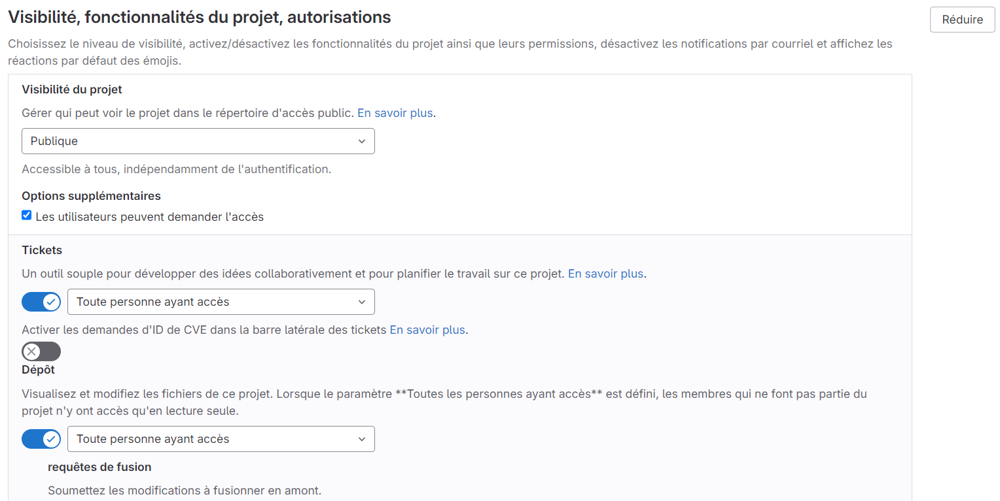

===================================
Set up a ci cd pipeline with Gitlab
===================================

Gitlab
======

Go to the tab Parameters, CI/CD, variables and click on display

.. image:: img/variables.png

Complete these variables with your data:

.. image:: img/all-variables.png

**For DJANGO_DEBUG veriable put at `True`**

.. image:: img/django-debug.png

For:
DEPLOY_HOOK_1
DEPLOY_HOOK_2
RENDER_API_TOKEN

**You will see later, when you will setup the deployement.**

On the general parameters, go to visibility and put settings like on this image:

