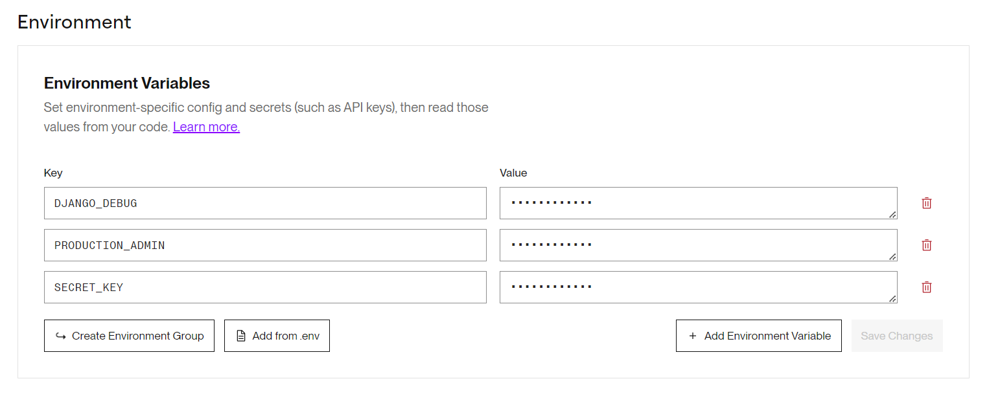

.. _CI-CD:

======
CI/CD
======

**This page will help you to setup a CI/CD pipeline with Gitlab and Render.**

Gitlab
======

**Now, create a new repository on your Gitlab account:**

.. image:: img/create-project.png

**Complete the informations and put the visibility in "public":**

.. image:: img/settings-repo.png

**Next we will push the project from your local machine to your new repository:**

.. code::

    git remote add origin "your https url repository"
    git push origin main

    Go to the tab Parameters, CI/CD, variables and click on display

    Complete these variables with your data

.. figure:: img/django-debug.png

    For DJANGO_DEBUG variable put at `False`

For these variables:

+ DEPLOY_HOOK_1
+ DEPLOY_HOOK_2

**You will see later, when you will setup the deployement.**

On the general parameters, go to visibility and put settings like on this image:

.. image:: img/visibility.png

Render
======

Once, youre create your **Render** account, you need to setup for the deployement:

First, click on `New Web Service`:

.. image:: img/render-dashboard.png

Second, click on `Existing image` and select the repo from your Docker Hub.
Add `:latest` to select the latest image:

Third, complete the informations (you can just change the name of the project for now)

**We need to add 2 variables:**

* key = DJANGO_DEBUG, value = 0
* key = SECRET_KEY, clique on `generate`

Click on **Save changes**

Finally, we need to get the deploy hook for **Gitlab**.

Go on **settings**, and copy the **deploy hook**:

The deploy hook got 2 values that we need: just after `https://api.render.com/deploy/srv-`
this is the DEPLOY_HOOK_1, and after `?key=` this is the DEPLOY_HOOK_2

So for example :
`https://api.render.com/deploy/srv-cd45454fd?key=rzacZY4tgh`

DEPLOY_HOOK_1 = cd45454fd
DEPLOY_HOOK_2 = rzacZY4tgh

Now go back to your Gitlab account and go to the CI/CD parameters.
Add these 2 variables : 

* DEPLOY_HOOK_1 = the value deploy-hook after `srv-`
* DEPLOY_HOOK_2 =  the value of your deploy-hook `?key=`

Launch a pipeline to test and you will see that the deployement on **Render** success !

Reference `CI-CD`_.