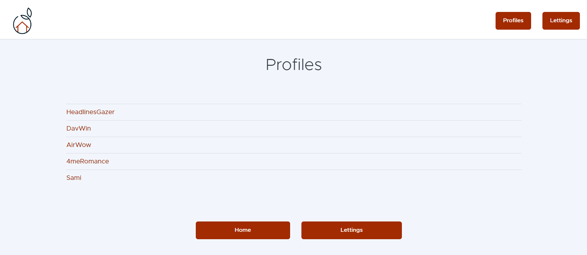
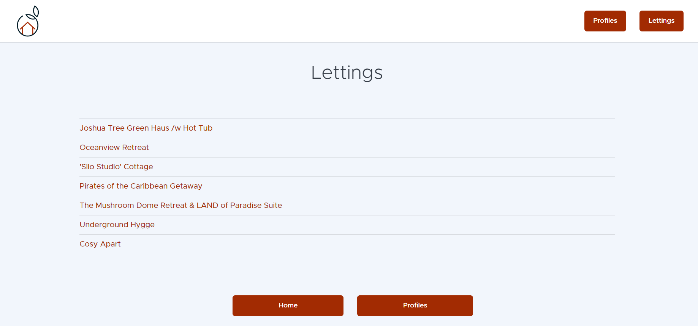

===================
Project description
===================

.. image:: img/logo.png
Orange County Lettings is a fictional learning web application.
This is a Django application for managing real estate rentals.

This application is part of the OpenClassRooms Python Developer Designer course.
.. image:: img/home.png

Users can:
Create new profiles

Publish apartments or house for rent.
