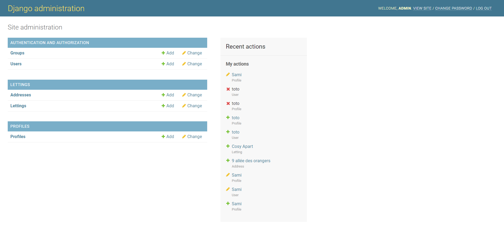

.. _Description:

===================
Project description
===================

.. image:: img/logo.png
    :align: center

**--------------------------------------------------------------**

**Orange County Lettings is a fictional learning web application.
This is a Django application for managing real estate rentals.**

**This application is part of the OpenClassRooms Python Developer Designer course.**

.. image:: img/home.png
    :align: center

**In this application, you can see the lettings and the profiles of lettings author of the website.**

**An administrator can create, remove and delete easily a profile/letting in his dashboard.**

Reference `Description`_.