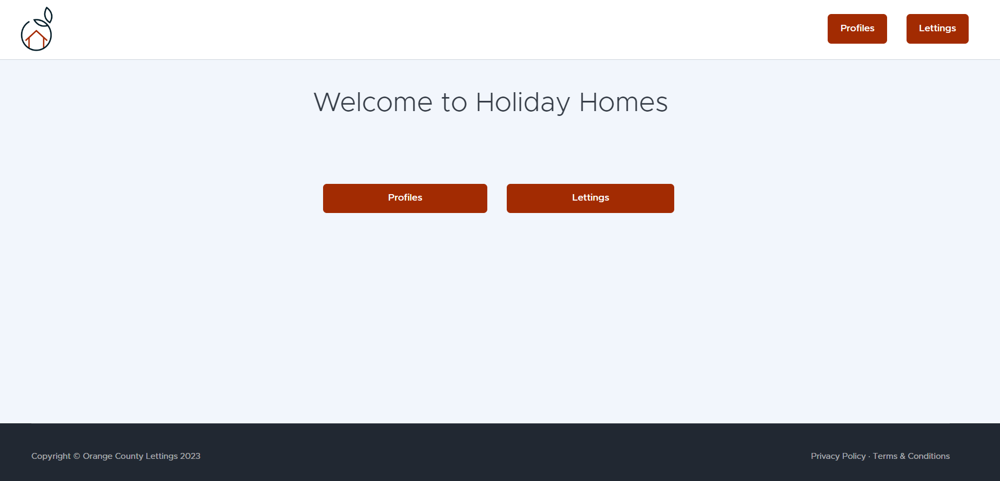
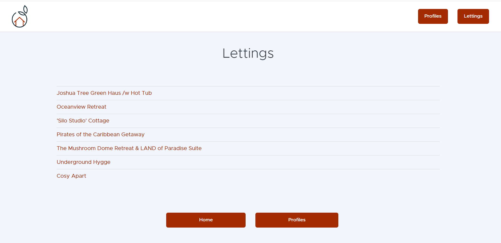
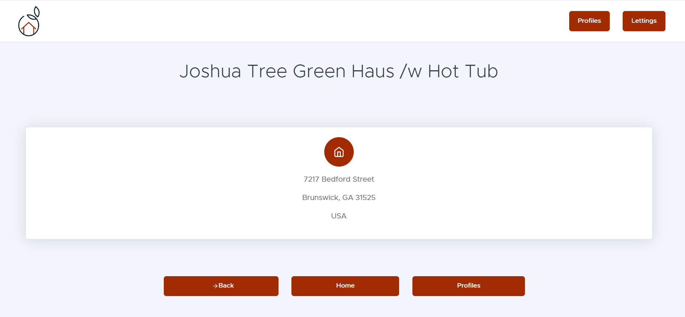
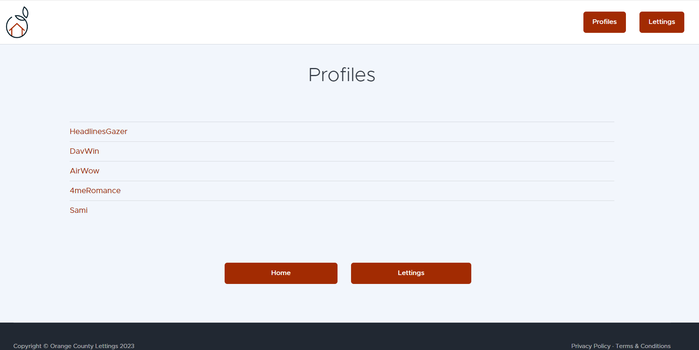
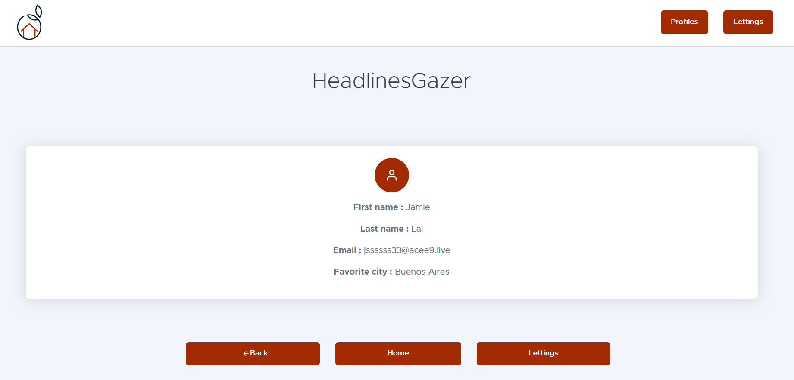

.. _Guides:

=====
Guide
=====

User go on website and search for a letting
==============================================

**The user go on homepage and click on "lettings" button.**

**The user is on lettings page and can see all the lettings and select one of them.**

**The user is on letting page and can see details about the selected letting.**

User go on website and search for a profile
===========================================

**The user go on homepage and click on "profiles" button.**

**The user is on profiles page and can see all the profiles and select one of them.**

**The user is on profile page and can see details about the selected profile.**

