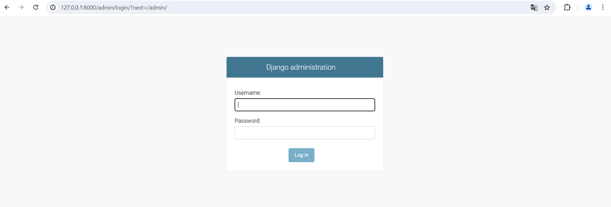
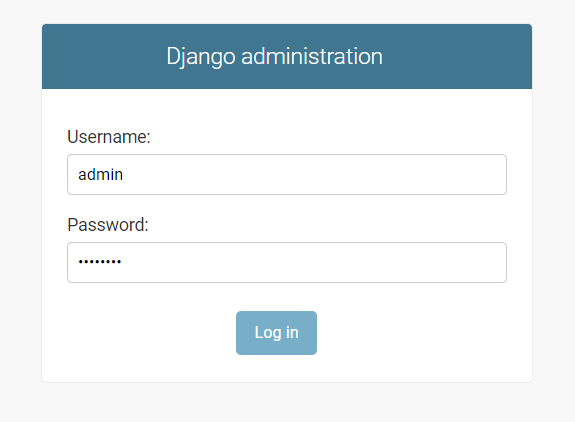

.. _Installation:

============
Installation
============

Clone the project on your local machine
=======================================

**Type this command on your terminal to clone the project:**

.. code-block::

    git clone 'https://gitlab.com/sf5810217/oc_lettings.git'

Run in local
============

**Next, we need to create our local environment:**

.. code-block::

    python -m venv venv

**Now activate our local environment:**

*In Windows:*

.. code-block::

    venv/Scripts/activate.bat

*In MacOS:*

.. code-block::

    venv/bin/activate

**First, make an update of pip:**

.. code-block::

    python -m pip install --upgrade pip

**Second, we need to install all dependances:**

.. code-block::

    pip install -r requirements.txt

**Finally, we must to create a .env files for the configuration settings:
Create a '.env' files and copy paste this code:**

.. code-block::

    SECRET_KEY = "yoursecretkey"
    DSN = "your dsn sentry"
    DJANGO_DEBUG = 'True'
    ALLOWED_HOSTS = ['*']

**The secret key is a component essential for the security of your django application. She's use by Django
for:**

* cryptographic signatures
* password hashing
* injection protection

**The Sentry DSN is an url to allows the application to send events to your Sentry instance:**

* error
* exceptions
* messages

Quickstart
==========

**Once you clone the repository and files .env create, we need to make the migrations database:**

.. code-block::
 
    python manage.py makemigrations
    python manage.py migrate
    python manage.py check

**Launch the application works locally:**

.. code-block::

    python manage.py runserver

**Do some tests**

.. code-block::

    python manage.py test

**Verify linting**

.. code-block::

    flake8

**Verify the test coverage and generate a html report**

.. code-block::

    pytest --cov=. --cov-report html

Admin dashboard
===============

**To access to the admin dashboard, go on admin login : http://127.0.0.1:8000/admin/**

To log:
username: **admin**
password: **Abc1234!** 

**You are now on your dashboard and you can easily manage your data**

.. image:: img/dashboard.png
