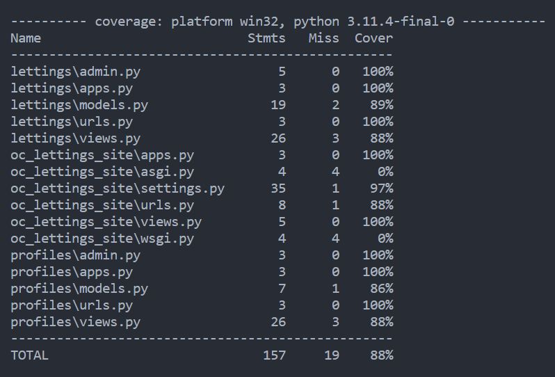
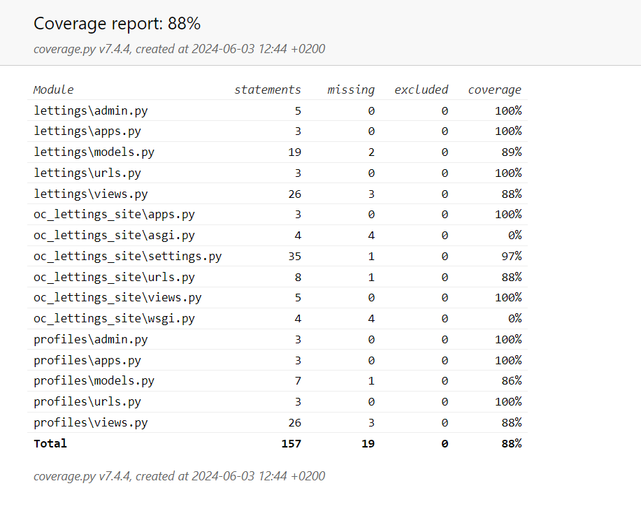

=====
Tests
=====

**You can run the tests of the application by launch the command:**

.. code-block::

    python manage.py test

**Or you can select a test by add the directory:**

.. code-block::

    python manage.py test lettings

**For see the coverage tests of your application: **

.. code-block::

    pytest --cov=.

**You can see in the shell the test coverage: **

**You can generate an html report with the option coverage-report: **

.. code-block::

    pytest --cov=. --cov-report html

**This will be create a directory `htmlcov`. Go on this directory and click on index.html to see the report:**

