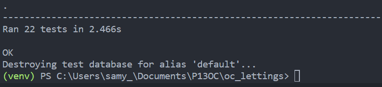
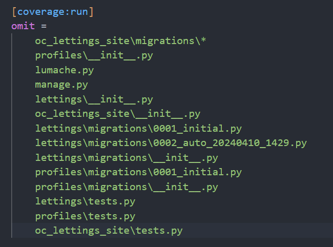
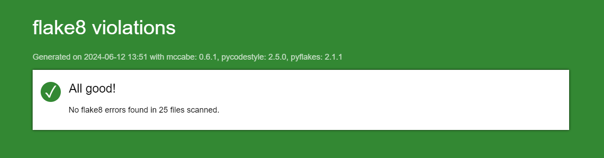
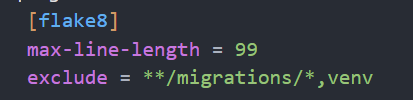

.. _Tests:

=================
Tests and linting
=================

**You can run the tests of the application by launch the command:**

.. code-block::

    python manage.py test

**You will see the number of test execute in the shell**

**Or you can select a test by add the directory:**

.. code-block::

    python manage.py test lettings

**For see the coverage tests of your application:**

.. code-block::

    pytest --cov=.

**You can see in the shell the test coverage:**

.. image:: img/coverage-shell.png

**You can generate an html report with the option coverage-report:**

.. code-block::

    pytest --cov=. --cov-report html

**This will be create a directory `htmlcov`. Go on this directory and click on index.html to see the report on your browser:**

.. image:: img/coverage-html.png

**For the coverage test, we decided to omit some directory optional.
But if for any reasons, you want to add some others files you can change the files "setup.cfg".**

**You can add/remove a file or a directory of your choices:**

Linting
=======

**You can see if the code respect the** `Pep8 convention <https://peps.python.org/pep-0008/>`_

.. code-block::

    flake8

**You can generate a html report via this command:**

.. code-block::

    flake8 --format=html --htmldir=flake-report

**"flake-report" is the name of the directory where you want that the report will be generate.**

**Go on the directory and open "index.html"**

**Like for coverage report, you can change the linting configuration in the setup-cfg file.**

**You can add/remove a file or a directory of your choices. You can also add/remove rules:**

Reference `Tests`_.